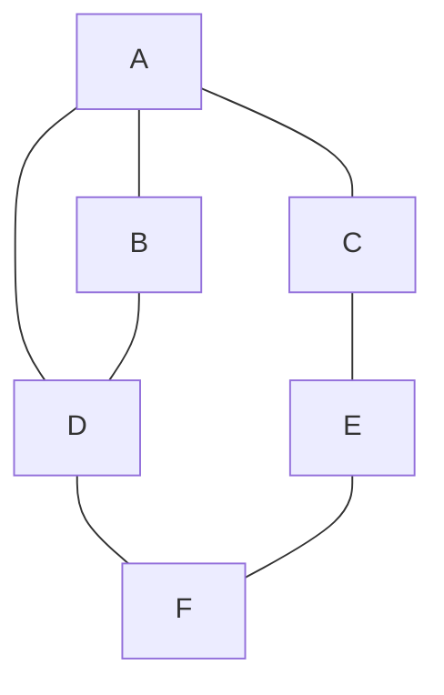
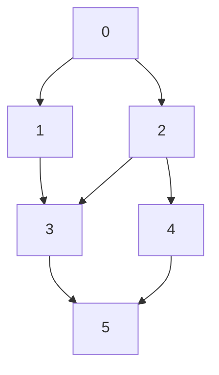
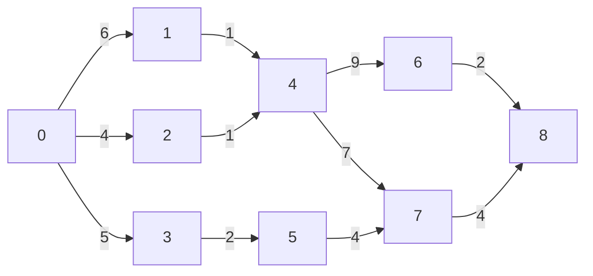
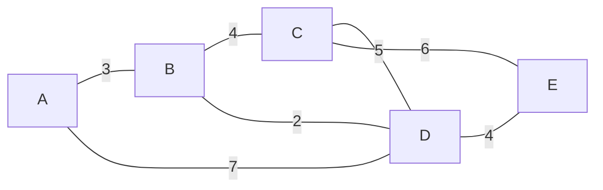

# 图论算法测试样例

## 测试 1：DFS & BFS 遍历

**菜单选项：** `1` → `0`（无向图）

### 输入

```
6 7
A
B
C
D
E
F
0 1 1
0 2 1
0 3 1
1 3 1
2 4 1
3 5 1
4 5 1
```

### 图的样子



### 预计输出

```
Adjacency List:
  [0] A  (in:3) -> D(w:1) C(w:1) B(w:1)
  [1] B  (in:2) -> D(w:1) A(w:1)
  [2] C  (in:2) -> E(w:1) A(w:1)
  [3] D  (in:3) -> F(w:1) B(w:1) A(w:1)
  [4] E  (in:2) -> F(w:1) C(w:1)
  [5] F  (in:2) -> E(w:1) D(w:1)

DFS: A D F E C B

BFS: A B C D E F
```

> **说明：** DFS 具体顺序取决于边插入顺序（头插法），你的输出可能略有不同，只要符合深度优先逻辑即可。BFS 一定是按层展开，A→B/C/D→E/F。

---

## 测试 2：拓扑排序

**菜单选项：** `2`（自动为有向图）

### 输入

```
6 7
0
1
2
3
4
5
0 1 1
0 2 1
1 3 1
2 3 1
2 4 1
3 5 1
4 5 1
```

### 图的样子



### 预计输出

```
Adjacency List:
  [0] 0  (in:0) -> 2(w:1) 1(w:1)
  [1] 1  (in:1) -> 3(w:1)
  [2] 2  (in:1) -> 4(w:1) 3(w:1)
  [3] 3  (in:2) -> 5(w:1)
  [4] 4  (in:1) -> 5(w:1)
  [5] 5  (in:2) ->

Topo: 0 2 4 3 1 5
Topological sort succeeded.
```

> **说明：** 拓扑序列不唯一，只要满足所有前驱在后的约束即为正确。比如 `0 1 2 3 4 5` 也是合法结果。

---

## 测试 3：关键路径（AOE 网）

**菜单选项：** `3`（自动为有向图）

### 输入

```
9 11
0
1
2
3
4
5
6
7
8
0 1 6
0 2 4
0 3 5
1 4 1
2 4 1
3 5 2
4 6 9
4 7 7
5 7 4
6 8 2
7 8 4
```

### 图的样子



### 预计输出

```
Adjacency List:
  [0] 0  (in:0) -> 3(w:5) 2(w:4) 1(w:6)
  [1] 1  (in:1) -> 4(w:1)
  [2] 2  (in:1) -> 4(w:1)
  [3] 3  (in:1) -> 5(w:2)
  [4] 4  (in:3) -> 7(w:7) 6(w:9)
  [5] 5  (in:1) -> 7(w:4)
  [6] 6  (in:1) -> 8(w:2)
  [7] 7  (in:2) -> 8(w:4)
  [8] 8  (in:2) ->

Critical path:
  0 -> 1  (weight: 6)
  1 -> 4  (weight: 1)
  4 -> 6  (weight: 9)
  4 -> 7  (weight: 7)
  6 -> 8  (weight: 2)
  7 -> 8  (weight: 4)
Project minimum duration: 18
```

> **说明：**
> - 两条关键路径：`0→1→4→6→8`（6+1+9+2=18）和 `0→1→4→7→8`（6+1+7+4=18）
> - 路径 `0→3→5→7→8`（5+2+4+4=15）因工期更短，不会出现在输出中

---

## 测试 4：Dijkstra 最短路径

**菜单选项：** `4` → `0`（无向图）→ 起点输入 `0`

### 输入

```
5 7
A
B
C
D
E
0 1 3
0 3 7
1 2 4
1 3 2
2 3 5
2 4 6
3 4 4
```

起点：`0`

### 图的样子



### 预计输出

```
Adjacency Matrix:
      A   B   C   D   E
  A   0   3   ∞   7   ∞
  B   3   0   4   2   ∞
  C   ∞   4   0   5   6
  D   7   2   5   0   4
  E   ∞   ∞   6   4   0

Shortest paths from A:
  B: dist=3, path=A -> B
  C: dist=7, path=A -> B -> C
  D: dist=5, path=A -> B -> D
  E: dist=9, path=A -> B -> D -> E
```

> **说明：**
> - A→D 直达距离 7，但绕路 A→B→D = 3+2=5 更短——验证算法能发现绕路更优
> - A→C 和 A→E 没有直达边，矩阵中显示 `∞`
> - 每条输出都标注了完整路径和累计距离